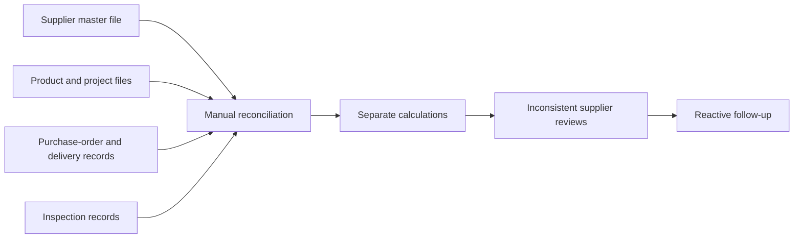
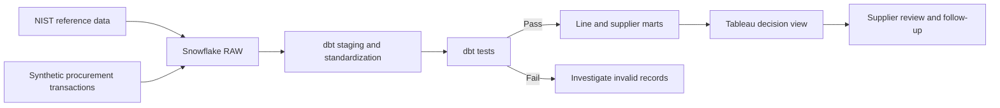
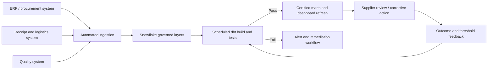

# As-is and to-be process

## As-is process

### As-is pain points

1. Supplier, order, delivery, and quality records are reviewed separately.
2. Analysts may calculate delivery, defects, and spending differently.
3. Manual joins and spreadsheet logic are difficult to audit and repeat.
4. Open commitments can be overlooked when attention is focused only on closed orders.
5. Supplier reviews are reactive and may overemphasize price.
6. Data issues may be discovered after a report is distributed.

## To-be process implemented in the prototype

### To-be improvements

- One transformation layer contains the agreed KPI logic.
- Model grain and entity relationships are explicit.
- Automated tests identify key and quantity issues before reporting.
- Procurement, operations, quality, and finance can review common measures.
- The dashboard combines executive KPIs with supplier and time-based views.
- Requirements and UAT evidence are traceable to outputs.

## Future production process

## Process controls

| Control point | Rule | Owner | Prototype evidence |
|---|---|---|---|
| Source completeness | Required identifiers must not be null | Data Owner | dbt `not_null` tests |
| Entity integrity | Orders, lines, products, suppliers, and inspections must relate correctly | Data Team | dbt relationship tests |
| Valid status | Order status must be OPEN, CLOSED, or CANCELLED | Procurement / Data Owner | dbt accepted-values test |
| Quantity validity | Received cannot exceed ordered; rejected cannot exceed inspected | Operations / Quality | Singular dbt test |
| KPI approval | Delivery, defect, spend, and exposure definitions require business sign-off | Functional owners | Requirements and decision log |
| Report reconciliation | Tableau results must match certified mart outputs | Data Analyst / UAT users | UAT workbook |

## Change impact

| Area | As-is behavior | To-be behavior | Adoption consideration |
|---|---|---|---|
| KPI ownership | Calculations may vary by analyst | Definitions are approved and reusable | Assign one owner per KPI |
| Supplier review | Price and anecdotal issues may dominate | Delivery, quality, value, and exposure are reviewed together | Train users to inspect components rather than only the risk label |
| Data quality | Issues are found during reporting | Tests identify issues before mart publication | Define who investigates and when reporting is paused |
| Reporting | Manual refresh and reconciliation | Repeatable transformation and dashboard output | Set refresh expectations and publish data timestamps |
| Risk classification | Informal judgement | Transparent rule as a starting point | Recalibrate with real history and minimum-volume rules |
